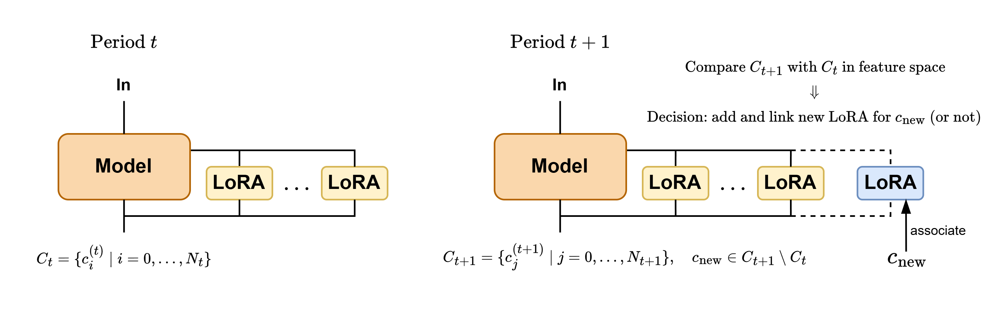

# DynEx-CLoRA

A modular framework for **Class-Incremental Continual Learning (CIL)**, supporting five mainstream strategies:

- **EWC** (Elastic Weight Consolidation)
- **MSE Distillation** (Knowledge Distillation via MSE Loss)
- **PNN** (Progressive Neural Networks)
- **LoRA** (Standard Low-Rank Adapter)
- **DynEx-CLoRA** (Ours: Dynamically Expandable LoRA with class-guided adaptation)

This repository provides reusable training **frameworks** and **task-specific implementations** across multiple domains, enabling easy experimentation and benchmarking for evolving continual learning problems.

---

## 🔧 Project Structure
```
DynEx_CLoRA/
│
├── ewc.py
├── mse.py
├── pnn.py
├── lora.py
├── dynex_clora.py
│
└── use_cases/
    ├── btc/ # Bitcoin Trend Prediction
    ├── cpsc2018/ # ECG Classification (CPSC2018)
    └── har/ # Human Activity Recognition
```


---

## 🚀 Features

- ✅ Unified framework for **five continual learning methods**
- ✅ Easily adaptable to **new tasks** with minimal configuration
- ✅ Support for **dynamic LoRA adapter growth**
- ✅ Pre-integrated with **feature similarity**, **class-wise mapping**, and **selective freezing**
- ✅ Consistent model evaluation, checkpointing, and class-wise accuracy reporting

---

## 📁 `use_cases/` Structure

Each subfolder in `use_cases/` contains:

- ✅ 5 Python scripts: one per method (e.g., `btc_ewc.py`, `btc_dynex_clora.py`)
- ✅ `model.py`: candidate backbone models (tested and tuned for the task)
- ✅ `data_source.txt`: instructions on how to prepare or download the datasets

> ⚠️ **Note:** Datasets are not included in this repo. Please refer to each folder's `data_source.txt` for how to prepare input files.

---

## 🧠 Base Model Selection

For each use case, we tested several models (e.g., MLP, ResNet18_1D, BiGRUWithAttention) and selected the **most stable and performant one** to serve as the base model for all five continual learning methods.

- For example:
  - `btc/model.py`: uses `BiGRUWithAttention`
  - `har/model.py`: uses `MLP`
  - `cpsc2018/model.py`: uses `ResNet18_1D`

You can easily switch to your own model by modifying `model.py` and adapting the corresponding method scripts.

---

## 🧩 Method Frameworks (Top-Level `*.py`)

These files define **pure learning strategies** with reusable code across tasks:

| File             | Description                                                   |
|------------------|---------------------------------------------------------------|
| `ewc.py`         | EWC training loop with Fisher computation                     |
| `mse.py`         | Knowledge distillation with MSE loss on stable classes        |
| `pnn.py`         | Progressive Neural Network with column fusion logic           |
| `lora.py`        | Standard LoRA fine-tuning logic + parameter management        |
| `dynex_clora.py` | Our dynamic LoRA system (progressive + similarity-driven)     |

These frameworks are **task-agnostic** and can be easily reused in new continual learning problems.  
To use, simply plug in your own model, data loader, and training configuration.

---

## 📐 DynEx-CLoRA Framework (Architecture)

The core idea of **DynEx-CLoRA** is to dynamically grow LoRA adapter groups over time based on **semantic drift and class similarity**.

- Each group of LoRA adapters is associated with one or more related classes.
- At each new period, class-wise features are compared with prior representations.
- Based on similarity:
  - A new adapter is added for novel concepts.
  - Existing adapters are reused or selectively unfrozen if concept drift is detected.

<p align="center">
  
</p>

This strategy **balances plasticity and stability** by preserving relevant features while flexibly adapting to concept evolution.

---

## 📝 Tips for Using This Repository

✅ **1. Adjust paths and configs carefully**  
Each script assumes you have configured:
- Base directory (`BASE_DIR`)
- Training data paths (`X_train`, `y_train`, etc.)
- Output save paths and stop-signal logic

✅ **2. Understand each method’s assumption**
- `ewc.py`: Requires Fisher info computed from prior tasks
- `mse.py`: Assumes presence of a frozen teacher model and `stable_classes`
- `dynex_clora.py`: Uses class similarity to decide LoRA expansion/unfreeze

✅ **3. Customize your backbone model**  
Each use case includes a `model.py`. We encourage you to:
- Swap in your own architecture
- Ensure it supports `.get_trainable_parameters()` if using LoRA

✅ **4. When using LoRA (standard or DynEx-CLoRA):**
- Call `model.init_lora()` (Standard LoRA) or `model.add_lora_adapter()` (DynEx)
- Use `model.get_trainable_parameters()` for correct optimizer setup
- Verify that newly added LoRA adapters are assigned to specific class groups

✅ **5. Dynamic expansion logic (`dynex_clora.py`)**
- `class_features_dict`: Accumulates class-wise feature centroids across periods
- `related_labels`: Maps adapter group indices to associated classes
- `similarity_threshold`: Core hyperparameter controlling LoRA creation/unfreeze
- Adapter group index grows across periods, allowing reuse and frozen isolation

---

Happy continual learning! ✨

